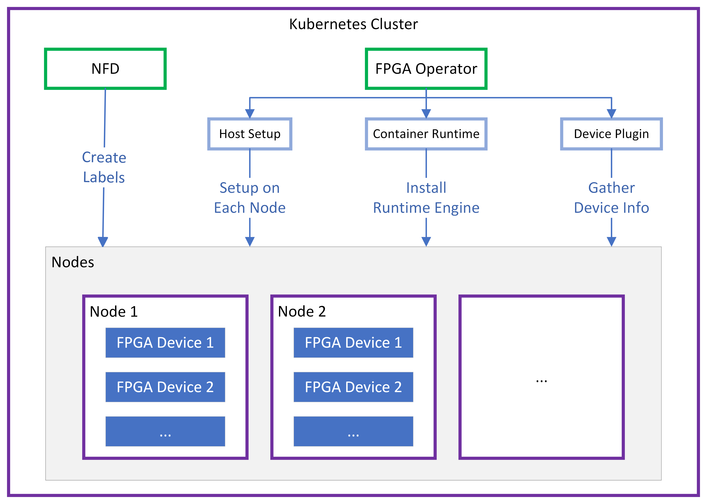

.. 
   Copyright (C) 2023, Advanced Micro Devices, Inc. - All rights reserved
  
   Licensed under the Apache License, Version 2.0 (the "License");
   you may not use this file except in compliance with the License.
   You may obtain a copy of the License at
  
       http://www.apache.org/licenses/LICENSE-2.0
  
   Unless required by applicable law or agreed to in writing, software
   distributed under the License is distributed on an "AS IS" BASIS,
   WITHOUT WARRANTIES OR CONDITIONS OF ANY KIND, either express or implied.
   See the License for the specific language governing permissions and
   limitations under the License.

.. meta::
   :keywords: Compute Unit, Kernel, Container, Kubernetes
   :description: 
   :xlnxdocumentclass: Document
   :xlnxdocumenttype: Tutorials

*************
FPGA Operator
*************

Kubernetes provides access to special hardware resources such as Xilinx FPGAs and other devices through the device plugin framework. 
However, configuring and managing nodes with these hardwares requires configuration of multiple software components such as XRT, container runtime and device plugin.
The FPGA Operator uses the operator framework within Kubernetes to automate the management of Xilinx software components needed to provision Xilinx FPGA devices.

To learn more about Kubernetes and Kubernetes operator:

* `Kubernetes <https://kubernetes.io/>`_

* `What is a Kubernetes operator? <https://www.redhat.com/en/topics/containers/what-is-a-kubernetes-operator>`_

* `Operator framework <https://operatorframework.io/>`_

.. toctree::
   :maxdepth: 1
   :caption: Getting Started

   Prerequisites <prerequisites.rst>

   Install FPGA Operator <install.rst>

   Release Note <release.rst>

.. toctree::
   :maxdepth: 1
   :caption: User Guide

   Major Components <components.rst>

   Deployment Customization <customization.rst>

   Upgrade and Uninstallation <upgrades.rst>

   Running Sample FPGA Application <samples.rst>

